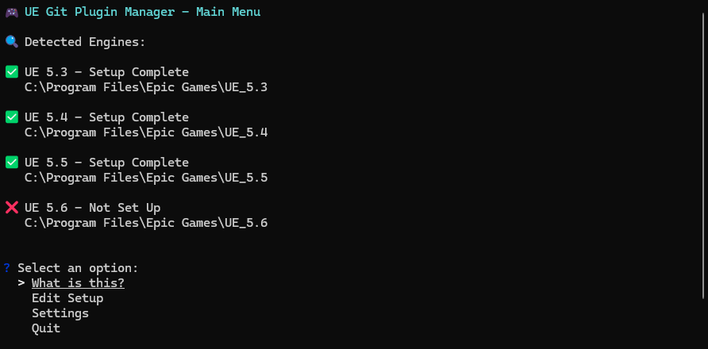

# UE Git Plugin Manager

> A Windows CLI tool that automates the setup and management of the [UEGitPlugin](https://github.com/ProjectBorealis/UEGitPlugin) across multiple Unreal Engine installations.



## Why Use This Tool?

Setting up Git source control in Unreal Engine manually is complex and error-prone. It involves:

- Cloning the UEGitPlugin repository
- Building the plugin against each UE version
- Creating Windows junctions to link the plugin into engine directories
- Managing conflicts with the stock Git plugin
- Keeping everything updated across multiple engine versions

This tool automates all of these steps, saving time and reducing errors for teams working with multiple Unreal Engine versions.

## Features

- **One-click setup** for multiple Unreal Engine versions
- **Automatic plugin linking** using Windows junctions
- **Update management** with commit tracking and browser integration
- **Collision detection** and resolution for stock Git plugins
- **Per-engine configuration** and management
- **Silent operation** - no annoying beeps or sounds

## Requirements

- Windows 10/11
- Git for Windows (must be in PATH)
- Unreal Engine 5.3+ (one or more installations)
- No administrator privileges required on modern Windows

## Installation

1. Download the latest release from [GitHub Releases](https://github.com/benjavides/ue-git-plugin-manager/releases)
2. Extract `UE-Git-Plugin-Manager.exe` to any location
3. Run the executable

## Quick Start

1. **Run the tool**
   ```cmd
   UE-Git-Plugin-Manager.exe
   ```

2. **Set up an engine**
   - Select "Edit Setup"
   - Choose an engine version from the list
   - Click "Install Setup"
   - The tool handles everything automatically:
     - Clones the UEGitPlugin repository
     - Creates a worktree for the engine version
     - Builds the plugin against the engine
     - Creates a junction to link the plugin
     - Disables the stock Git plugin (recommended)

3. **Use Git in Unreal Engine**
   - Open your project in Unreal Engine
   - The Git source control should now be available
   - You can commit, push, pull, and manage branches directly in the editor

## How It Works

The tool creates a streamlined setup by:

1. **Repository Management**: Clones the UEGitPlugin repository once to a central location
2. **Worktrees**: Creates separate working directories for each UE version (all using the same codebase)
3. **Plugin Building**: Builds the plugin against each specific Unreal Engine version
4. **Junction Linking**: Creates Windows junctions to link the built plugin into each engine's plugin directory
5. **Conflict Resolution**: Automatically detects and resolves conflicts with the stock Git plugin

This approach ensures each engine gets a properly built plugin while sharing the same source code and updates.

## Updating

The tool automatically checks for updates:

- Shows how many commits behind your setup is
- Displays local and remote commit SHAs
- Provides a GitHub compare URL to see what's changed
- Only rebuilds when updates are actually available

To update, go to "Edit Setup" → Select an engine → "Update Setup".

## Managing Multiple Engines

You can set up the plugin for multiple Unreal Engine versions:

- Each version gets its own worktree and build
- All versions share the same source code and updates
- Manage each engine independently
- Easy to add or remove engines as needed

## Troubleshooting

**"Git not found"**: Install Git for Windows and ensure it's in your PATH

**"No engines found"**: The tool looks in standard UE installation paths. Add custom paths in Settings if needed

**Plugin not working**: Check that the junction was created correctly and the stock Git plugin is disabled

**Build errors**: Ensure you have the correct Visual Studio components installed for your UE version

## Credits

- [Project Borealis](https://github.com/ProjectBorealis/UEGitPlugin) for the UEGitPlugin
- Built with Go and [promptui](https://github.com/manifoldco/promptui) for the CLI interface

## License

This project is open source. See the repository for license details.